# Transcription factors encode lineage but not developmental state in the mouse mammary epithelium

**Thikra Alwazzan**
Single-cell RNA-seq mini project, bioinformatics summer school, 2026
Dataset: Bach et al. (2017), GEO GSE106273

---

## Contents

1. [Introduction](#1-introduction)
2. [Data](#2-data)
3. [Method](#3-method)
4. [Results](#4-results)
5. [Limitations](#5-limitations)
6. [What I would do next](#6-what-i-would-do-next)
7. [References](#7-references)

---

## 1. Introduction

Transcription factors are the proteins that bind DNA and switch other genes on
and off. Because they sit at the top of the regulatory hierarchy, there is a
natural intuition that they are what makes a cell what it is: that if you knew
a cell's transcription factors, you would know its identity, and the thousands
of other genes it expresses are downstream consequences rather than causes.

This project tests that intuition directly on one dataset.

Bach et al. (2017) published a single-cell reference atlas of the mouse mammary
epithelium across four developmental stages. Their Figure 1 shows that cells
separate by developmental stage and split into a basal and a luminal
compartment; their Figure 2 identifies fifteen transcriptional states and the
marker genes that define each. It is an atlas, and atlases describe rather than
test. Nothing in the paper asks whether the transcription factors alone would
have been enough to find those fifteen states.

That is the question I asked:

> **Is a mammary epithelial cell's identity recoverable from its transcription
> factors alone?**

The baseline task for the week was to reproduce Figures 1 and 2B to 2C, which I
did first, both because it was asked for and because I needed a trustworthy
reference clustering to compare against.

### The design, and why it has three arms rather than two

I clustered the same cells three times, holding every parameter fixed and
changing only which genes the algorithm was allowed to see.

| Arm | Gene set | Purpose |
|---|---|---|
| Reference | 3,000 highly variable genes | the standard analysis, the thing to be recovered |
| TF only | 1,346 transcription factors | the hypothesis |
| Control | 1,346 non-TF genes, matched for expression level | the thing that makes a negative result interpretable |

The control arm is the part of the design I care most about, so it is worth
being explicit about why it exists.

Transcription factor mRNAs are low abundance. In droplet-based single-cell data,
low abundance means high dropout: a gene is often recorded as zero in a cell
that is genuinely expressing it. So if I had run only two arms and the TF
clustering had come out poorly, I would have had two completely different
explanations and no way to choose between them:

1. transcription factors do not encode cell identity, or
2. transcription factors encode it perfectly well, but are too sparsely detected
   in this assay for the clustering to see it.

The control set is drawn from the same expression bins as the TF set, so it
suffers the same dropout. Comparing transcription factors against an
expression-matched control cancels most of explanation 2. Whatever the answer
turned out to be, it would mean something.

---

## 2. Data

### 2.1 The count matrices

Eight samples from Bach et al. (2017), GEO accession GSE106273: two independent
mice at each of four developmental stages.

| Sample | GEO accession | Stage |
|---|---|---|
| NP_1 | GSM2834498 | Nulliparous |
| NP_2 | GSM2834499 | Nulliparous |
| G_1 | GSM2834500 | Gestation |
| G_2 | GSM2834501 | Gestation |
| L_1 | GSM2834502 | Lactation |
| L_2 | GSM2834503 | Lactation |
| PI_1 | GSM2834504 | Post-involution |
| PI_2 | GSM2834505 | Post-involution |

The cells were sorted on EpCAM before sequencing, so the input is enriched for
epithelium but not pure. The matrices are CellRanger version 2 output.

At import I had **25,806 cells**: NP 4,376, G 6,021, L 9,603, PI 5,806. Those
per-stage counts match the numbers Bach et al. report before their own quality
control, which is my main evidence that I imported the right thing rather than
something subtly wrong.

Two practical points that cost me time and are worth recording:

- **CellRanger version 2 names the gene file `genes.tsv.gz`.** Version 3 renamed
  it `features.tsv.gz`, and that is the name Seurat's `Read10X()` looks for.
  Seurat does have a fallback for old data, but it only triggers on an
  uncompressed `genes.tsv`, and these are gzipped, so the fallback never fires.
  I copy the file under the name Seurat expects.
- **Mouse mitochondrial gene symbols are lowercase**, `mt-`, not `MT-`. The
  course material used human data and the uppercase pattern. On mouse data the
  uppercase pattern returns zero percent mitochondrial content for every cell,
  with no error and no warning, and the quality control silently does nothing.

### 2.2 The transcription factor list

AnimalTFDB 4.0, mouse (Shen et al., 2023). The list contains **1,611 unique gene
symbols**, of which **1,346** are present in this dataset's RNA assay. That is
84 percent, high enough that nothing systematic went wrong with symbol matching.

I used the curated TF list rather than inferring regulons with a tool such as
SCENIC. That was a time decision: SCENIC needs a new environment and a long run,
and the intersection of a published TF list with the expression matrix answers
my question at a fraction of the cost.

---

## 3. Method

All analysis in R 4.5.2 with Seurat v5, following the Cambridge Bioinformatics
Training single-cell course. Where I departed from the course material I say so
below and in the script itself.

### 3.1 Quality control, computed per sample

This is the methodological point I would most want to defend.

The eight samples are mice in four very different physiological states. A
lactating gland is producing milk protein at enormous scale, so its cells
genuinely have different library sizes, different numbers of detected genes and
a different mitochondrial fraction from a nulliparous mouse. Those differences
are biological, not technical.

A single global threshold across all samples would therefore preferentially
delete cells from specific stages, and then every stage comparison downstream,
including my own research question, would be comparing populations I had myself
biased. So every threshold is computed **inside its own sample**, using
`group_by(SampleName)` before the median and MAD calculations.

I also did not simply accept the course's default thresholds. A MAD-based cutoff
is *relative*: it removes a slice off the bottom of whatever distribution you
hand it, whether or not there is anything wrong with those cells. So I compared
three schemes before choosing (`scripts/01_import_and_quality_control.R`, part 3):

| Scheme | Genes | UMIs | Mitochondrial | Cells kept of 25,806 |
|---|---|---|---|---|
| A, the course default | median - 2 MAD | median - 2 MAD | median + 2 MAD | 23,696 |
| B, three MADs | median - 3 MAD | median - 3 MAD | fixed 5 percent | (intermediate) |
| C, the paper's rule | max(median - 3 MAD, 500) | max(median - 3 MAD, 1000) | fixed 5 percent | **25,802** |

Scheme A would have removed **2,110 cells**, 8.2 percent, with retention varying
from 88.8 to 93.5 percent **between** samples, which is exactly the
stage-dependent bias I was trying to avoid. It was doing this almost entirely on
a mitochondrial threshold that came out at roughly 1.2 to 1.5 percent per sample,
when the whole dataset only reaches 8.2 percent at its very worst. That is not a
threshold identifying dying cells, it is a threshold shaving the top off a narrow
distribution because it was told to.

I chose scheme C, the rule published in Bach et al.: three MADs below the median
with an absolute floor of 500 genes and 1,000 UMIs, and a fixed 5 percent
mitochondrial cutoff. The absolute floors are what make it safe: no matter how
tight one sample's distribution is, no cell with fewer than 500 genes survives.

**It removed 4 cells in total, leaving 25,802.** That is an honest result and I
report it as one. This dataset was already clean, and the correct response to
that is to say so, not to invent a threshold that removes a more respectable
looking number of cells.

### 3.2 Normalisation

Two normalisations, used for different things:

- `NormalizeData()`, the shifted-log transform (divide by the cell's total
  counts, multiply by 10,000, take log(x + 1)). I use this log-normalised RNA
  assay whenever I plot or test one gene at a time, and for the whole of the
  transcription factor analysis.
- `SCTransform()`, regularised negative binomial regression (Hafemeister and
  Satija, 2019), with the `glmGamPoi` backend for speed. This removes the
  mean-variance relationship the log transform leaves behind, and selects the
  3,000 most variable genes. I use it for PCA and clustering.

The RNA assay was split into one layer per sample before SCTransform, so a
separate model is fitted per sample. In this dataset each sample was captured on
its own 10x run, so sample and technical batch are the same thing.

**One deliberate departure:** the course calls SCTransform with
`vars.to.regress = "percent.mt"`. I left it out. Regressing a covariate is
applied gene by gene across the whole matrix and is the most expensive part of
the call, and my own diagnostics showed `percent.mt` has a median of 0.75 percent
and a maximum of 8.2 percent. There is essentially no variance there to remove.
I did not just assert this: I tested it afterwards by plotting `percent.mt` on
the UMAP (`results/graphs/02_percentmt_ncount.png`). Had a distinct island
turned out to be a mitochondrial hotspot, I would have gone back and re-run with
the regression.

### 3.3 Dimensionality reduction and the batch effect question

PCA on the SCTransform variable features. I kept **20 principal components**,
chosen from the elbow plot: a clear break after PC4, and per-component gains
falling below about 0.15 from roughly PC20 onwards.

t-SNE with **perplexity 50**, matching the paper's Methods so that my Figure 1b
is comparable to theirs, and UMAP alongside it as a check that the structure is
not an artefact of one embedding algorithm.

Here is the problem I had to deal with before interpreting anything. Each stage
was sequenced as its own run, so **developmental stage and sequencing batch are
perfectly confounded by the experimental design**. No amount of analysis can
separate them directly.

What I *can* do is use the replicates. There are two independent mice per stage.
If the separation between stages were a per-run technical effect, it would
separate the two mice within a stage as well, because they are different runs.

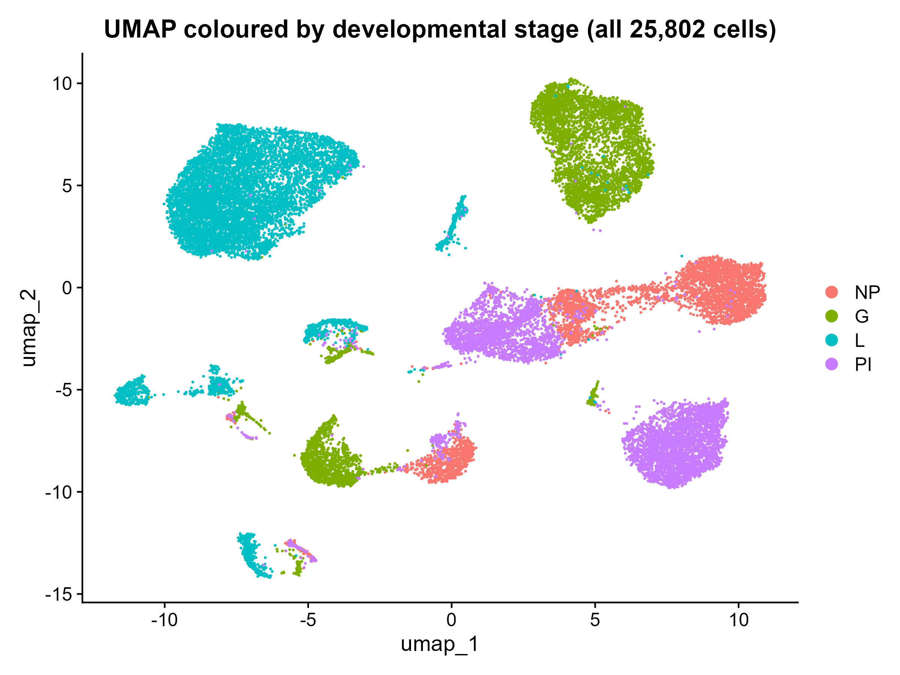

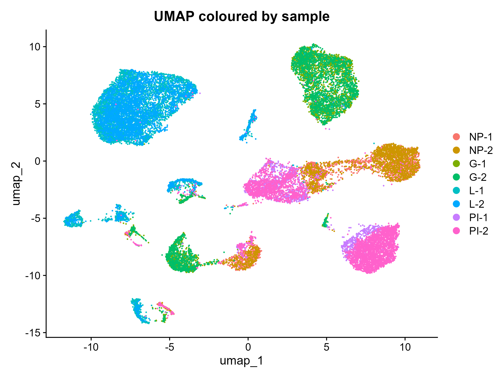

The first plot colours cells by stage, the second colours exactly the same cells
by individual mouse. The replicate pairs sit on top of each other while the
stages sit apart. Same position, different animals, different libraries. A batch
effect would not do that. This is why I did not run batch correction: correcting
here would have removed the biology I came to look at.

The same comparison on the epithelial t-SNE, after the non-epithelial cells were
removed, is in `results/graphs/03_tsne_by_sample.png` and
`results/graphs/03_fig1b_tsne_by_stage.png`. That is the version I point at in
the talk, because it is the same embedding as Figure 1b.

(The equivalent PCA-space version of this argument is produced by
`scripts/02_normalisation_and_dimension_reduction.R`, but I originally viewed those plots in the RStudio pane
without saving them, so they are not in `results/graphs/`. Re-running that script
writes them.)

### 3.4 Removing the non-epithelial cells

The cells were EpCAM-sorted, but immune, fibroblast and endothelial cells still
got through, and Bach et al. removed theirs. I clustered coarsely (Louvain,
k = 20, resolution 0.5, giving 19 clusters) purely to isolate them, then
identified them from lineage markers.

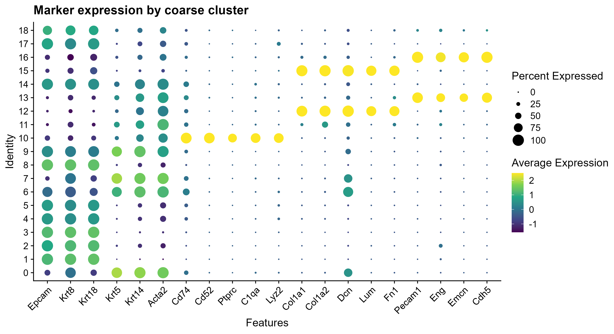

| Cluster | Identity | Evidence | Cells |
|---|---|---|---|
| 10 | immune | Cd74, Cd52, Ptprc, C1qa, Lyz2 high; Epcam low | 677 |
| 12 | fibroblast | Col1a1, Col1a2, Dcn, Lum, Fn1 high | 393 |
| 13 | endothelial | Pecam1, Eng, Emcn, Cdh5 high | 365 |
| 15 | fibroblast | as cluster 12 | 215 |
| 16 | endothelial | as cluster 13 | 163 |
| | | **total removed** | **1,813** |

**The trap in this step**, which I nearly walked into: Acta2 is a myoepithelial
marker as well as a smooth muscle and pericyte marker. Myoepithelial cells are
epithelial, and they are one of the largest populations here, nearly all from
the lactation samples. Removing them for being Acta2-positive would have
destroyed the entire lactation arm of the analysis. The discriminator is
epithelial identity, not the contractile genes: Acta2+ **and** Epcam/Krt-positive
means keep.

I also kept one ambiguous cluster rather than deleting it, on the grounds that
the costs are asymmetric. Keeping a contaminant is recoverable, because I can
label it and exclude it from interpretation. Deleting a real cell type is not
recoverable, because I would never know it had been there.

That leaves **23,989 epithelial cells**: NP 4,245, G 5,592, L 8,441, PI 5,711.
Bach et al. had 23,184. Mine is higher because I retained that ambiguous cluster
and because I did not go looking for their doublet cluster.

### 3.5 Choosing the clustering parameters instead of guessing

Clustering has two knobs, k (neighbours in the graph) and resolution (how finely
to cut it), and the number of clusters is entirely determined by what you set
them to. I did not want to pick values because they gave me a comfortable
answer, so I swept nine settings and scored each by mean silhouette width.

Silhouette width, briefly: for one cell, take its average distance to the other
cells of its own cluster (call it *a*) and its average distance to the cells of
the nearest other cluster (call it *b*). The silhouette is (b - a) / max(a, b).
It is near 1 if the cell sits comfortably inside its cluster, near 0 on a
boundary, negative if it would fit better elsewhere.

I computed it on a random subsample of 5,000 cells rather than all 23,989. The
course runs `dist()` on the full embedding, which is fine for its 2,000-cell
demonstration object, but at 24,000 cells the distance matrix is about 2.3 GB
and the silhouette calculation is quadratic on top of that.

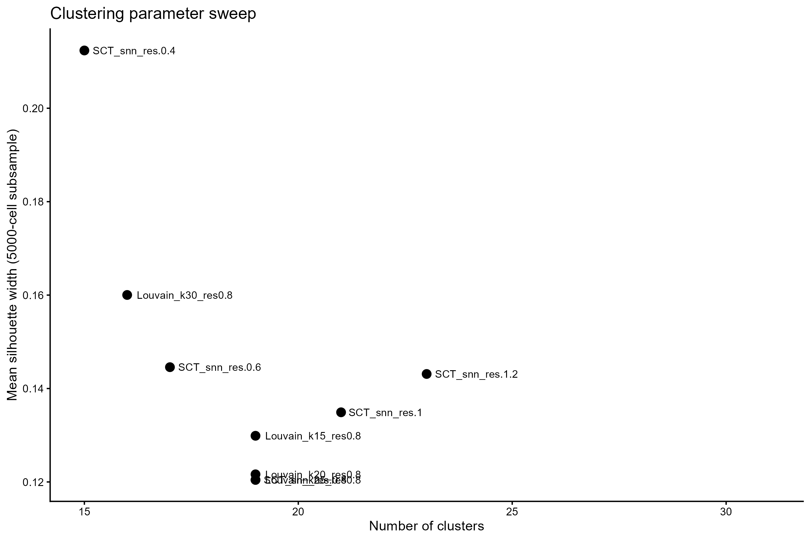

The winner was **Louvain, k = 25, resolution 0.4**, with a mean silhouette width
of **0.212** against **0.160** for the runner-up, a gap of about 30 percent. It
gave exactly **15 clusters**, which is the number Bach et al. report.

I want to be precise about the direction of that last point, because it would be
easy to overclaim. Fifteen was **not** my selection criterion. I selected on
silhouette width and fifteen fell out of it. Had I tuned the resolution until it
reproduced the paper's cluster count and then presented the match as a result,
that would have been circular.

I also checked that the result does not depend on the clustering algorithm.
Running Leiden once at the same parameters gave an adjusted Rand index of
**0.876** against my Louvain clustering.

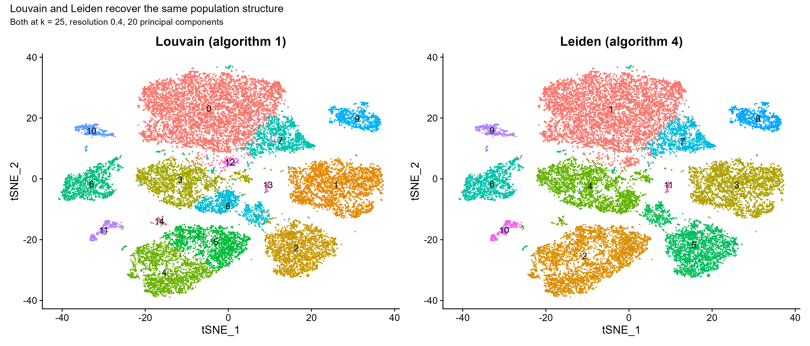

### 3.6 Software

R 4.5.2. Seurat v5 (Hao et al., 2024), sctransform (Hafemeister and Satija,
2019), glmGamPoi (Ahlmann-Eltze and Huber, 2021), cluster (silhouette), mclust
(adjusted Rand index), tidyverse, patchwork.

Two substitutions forced by my environment, both recorded in the scripts:

- The course uses `bluster::pairwiseRand()` for the adjusted Rand index.
  Bioconductor 3.22 ships bluster for Windows in source form only and building it
  needs a compiler, which I did not have. I used `mclust::adjustedRandIndex()`,
  which computes the identical statistic.
- Seurat v5's Wilcoxon marker test uses the `presto` package if installed and
  otherwise loops base R's `wilcox.test` one gene at a time. `presto` is not on
  CRAN and had no build for R 4.5, so I was on the slow path: measured at 41
  minutes for a single cluster, roughly 11 hours for all fifteen. I restructured
  the marker script so that the annotation does not depend on it, and ran the
  ranked marker lists with downsampling as an optional extra.

---

## 4. Results

### 4.1 Reproducing Figure 1

**Figure 1b, cells by developmental stage.** The four stages occupy distinct
regions of the embedding.

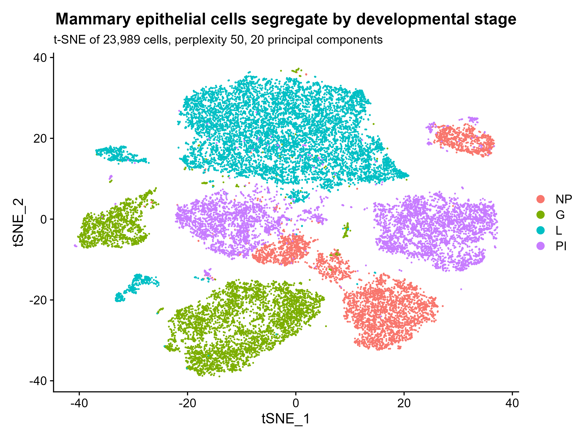

**Figure 1c, the fifteen clusters.** The cluster boundaries follow the same
divisions the stages do, which is the confounding described in section 3.3 made
visible.

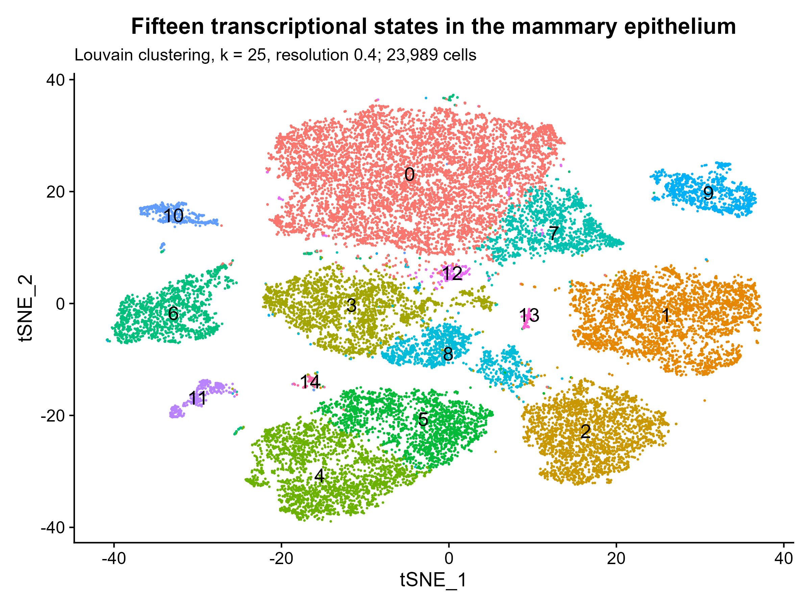

**Figure 1d, Krt5 and Krt18.** The basal marker and the luminal marker are almost
mutually exclusive. This is the first branch of the mammary epithelial
hierarchy, and it is also what PC1 turned out to be.

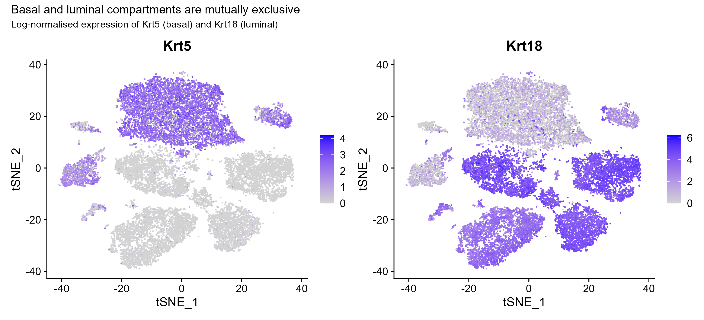

### 4.2 Reproducing Figure 2B and 2C

**Figure 2b, nine canonical lineage markers on the embedding.** Each marker
lights up one region and stays dark elsewhere. That is what makes them useful:
a gene expressed everywhere identifies nothing.

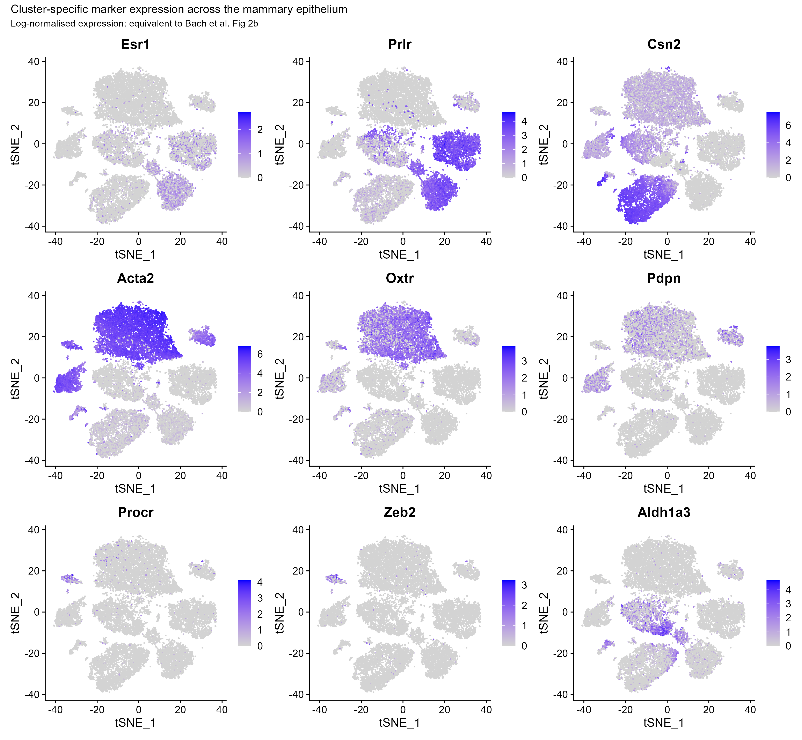

**Figure 2c, 34 markers as a scaled heatmap.** The bright blocks fall on the
diagonal, meaning every cluster has its own marker set. Following the paper, up
to 100 randomly selected cells are shown per cluster: without that, the
6,418-cell cluster would occupy most of the width and the 61-cell cluster would
be an invisible line, so the picture would be about cluster sizes rather than
about expression. Nothing is being tested here, so downsampling costs no
statistical power.

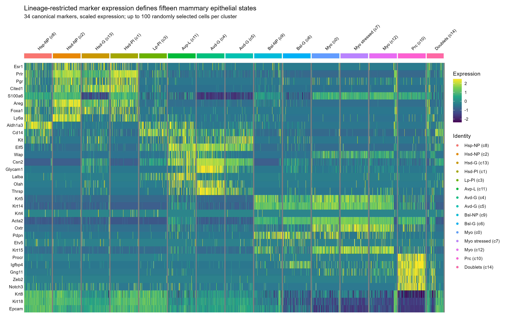

### 4.3 The annotated atlas

All fifteen identities were assigned from the published marker panel in Bach et
al.'s Table 1, cross-referenced against which stage each cluster came from. None
came from my own judgement about what a cluster "looked like".

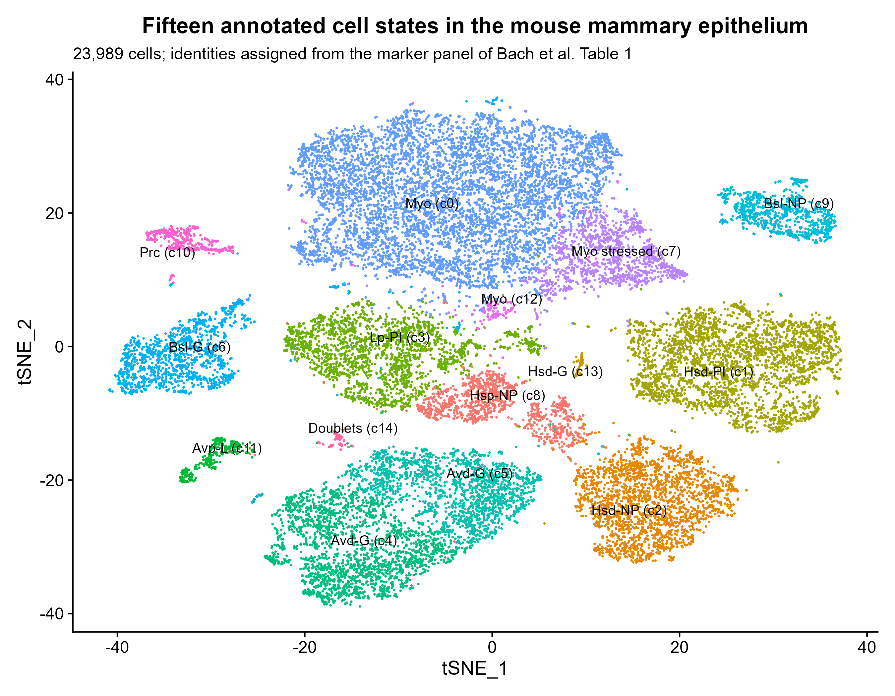

| Cluster | Label | Cells | Dominant stage | Identity |
|---|---|---|---|---|
| c8 | Hsp-NP | 1,121 | NP | hormone-sensing progenitor |
| c2 | Hsd-NP | 2,311 | NP | hormone-sensing differentiated |
| c13 | Hsd-G | 111 | G | hormone-sensing differentiated |
| c1 | Hsd-PI | 3,156 | PI | hormone-sensing differentiated |
| c3 | Lp-PI | 2,249 | PI | luminal progenitor |
| c11 | Avp-L | 342 | L | alveolar progenitor |
| c4 | Avd-G | 2,198 | G | alveolar differentiated |
| c5 | Avd-G | 1,846 | G | alveolar |
| c9 | Bsl-NP | 932 | NP | basal |
| c6 | Bsl-G | 1,394 | G | basal |
| c0 | Myo | 6,418 | L | myoepithelial |
| c7 | Myo stressed | 1,272 | L | myoepithelial, dissociation stress |
| c12 | Myo | 159 | L | myoepithelial |
| c10 | Prc | 419 | L | Procr+ basal (ambiguous, see limitations) |
| c14 | Doublets | 61 | mixed | likely doublets |

Full counts per stage are in `results/tables/annotation_table_clusters_by_stage.csv`.

Two clusters carry caveats that I state rather than bury:

- **c7** is my myoepithelial cluster split along a **technical** axis. Clusters
  c0 and c7 together are 7,690 cells against the paper's single myoepithelial
  cluster at 7,741. c7 is the standout for the immediate-early genes Fos, Jun and
  Egr1 and the heat shock gene Hspa1a, which is the classic
  enzymatic-dissociation signature (van den Brink et al., 2017), and exactly what
  PC4 of the epithelial PCA had predicted. So my clustering split one biological
  population by how stressed the cells were during tissue dissociation.
- **c10** expresses all four of the published Procr+ basal markers strongly, but
  is also Epcam-negative and positive for four mural (pericyte) markers. The
  original paper had the same ambiguity and resolved it the same way, by
  retaining the cluster and flagging it.

### 4.4 The research question

With a reference clustering I trusted, I ran the three-arm comparison.

**First, the control had to actually be a control.** The transcription factors
and the sampled control genes have closely overlapping expression distributions,
which is the property that matters, because it means both sets suffer comparable
dropout.

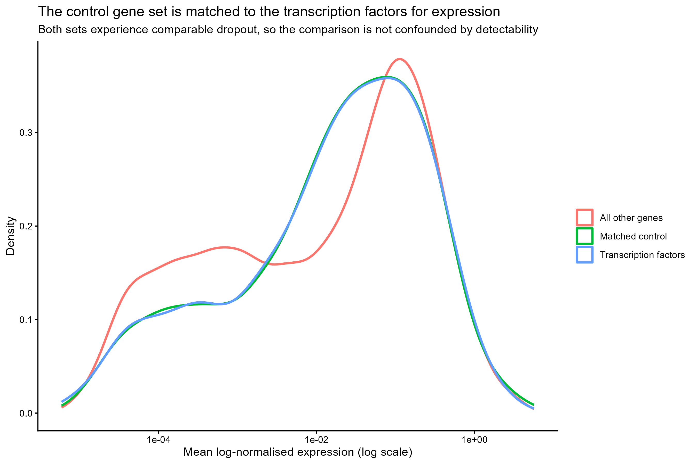

**Then the result.**

| Comparison | Genes | Clusters found | Adjusted Rand index |
|---|---|---|---|
| Transcription factors vs reference | 1,346 | 9 | **0.533** |
| Expression-matched control vs reference | 1,346 | 11 | **0.728** |
| Transcription factors vs control | | | 0.608 |

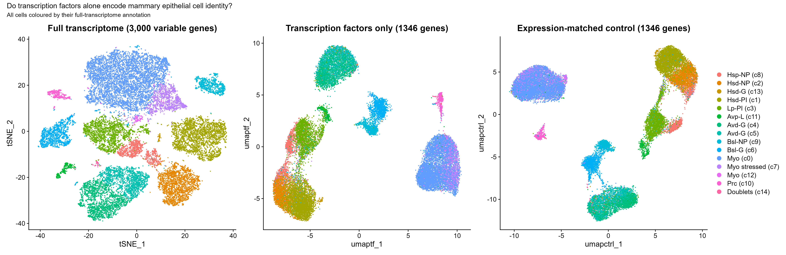

Every cell keeps the colour of its full-transcriptome annotation in all three
panels, so a colour that stays as one blob is a cell state that survived in that
gene space, and a colour that smears is one that did not.

**Transcription factors scored below the expression-matched control.** The
hypothesis was that transcription factors would be a privileged, information-rich
subset. They were not: on this data they were worse than an equally sparse set of
ordinary genes. This is not the answer I expected when I designed the experiment,
and I am reporting it as it came out rather than looking for a variant of the
analysis that agrees with me.

**Where it broke down is more informative than the number.** The
cross-tabulation of TF clusters against the reference annotation
(`results/tables/tf_clusters_vs_reference.csv`) shows that a single TF cluster
absorbed **6,057 cells**. Those cells are the hormone-sensing populations from
**all four developmental stages**, c8, c2, c13 and c1, together with the luminal
progenitors.

So the transcription factors did not fail evenly. They preserved the **lineage**,
keeping hormone-sensing cells apart from alveolar and basal cells, and lost the
**developmental state** within that lineage. The nulliparous, gestation and
post-involution versions of a hormone-sensing cell became indistinguishable.

That is a coherent biological reading rather than just a low score: what changes
as a mammary epithelial cell moves through pregnancy and lactation is largely its
effector output, milk protein genes, secretory machinery, and much less its
transcription factor repertoire. The transcription factors say what kind of cell
this is. They say much less about what it is currently doing.

I should be clear that this reading is an interpretation of the pattern in the
cross-tabulation, not something I tested independently.

---

## 5. Limitations

**Cell type and developmental stage are confounded by design.** Almost every
cluster comes from a single stage.

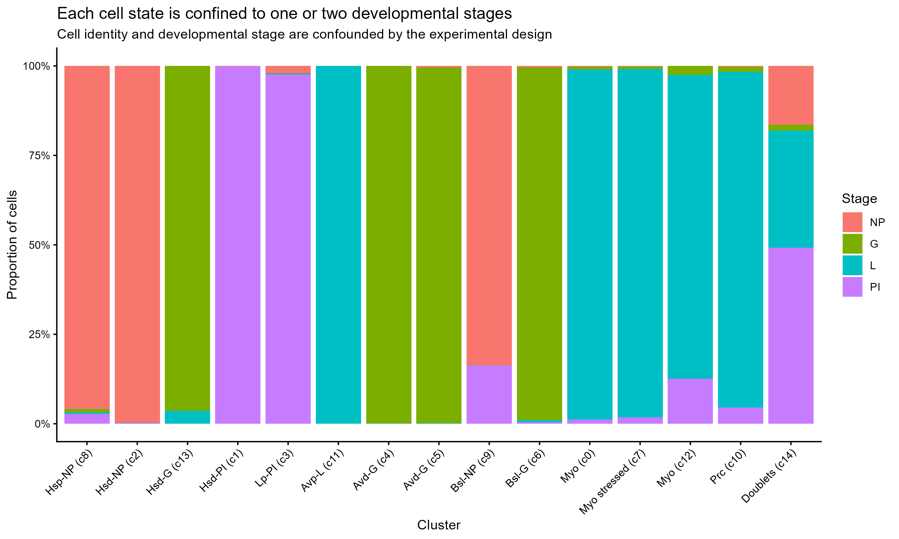

This is a property of the original experiment, not of my analysis, but it limits
what any claim of the form "transcription factors lost the developmental state"
can mean. In this dataset "developmental state" and "which mouse it came from"
are close to the same variable. I used the two replicates per stage to argue the
separation is not a sequencing batch effect (section 3.3), and I think that
argument holds, but it does not dissolve the underlying confounding.

**One population is split along a technical axis.** Cluster c7 is the
dissociation-stress half of the myoepithelial population. I did not remove it or
merge it back, so it is counted as a separate cell state in the reference
clustering that the TF arm is scored against.

**Silhouette width prefers coarser solutions.** It rewards compact, well
separated clusters, so the fact that it peaked at 15 clusters does not prove 15
is biologically correct. Bach et al. reached fifteen by a two-step route, coarse
clustering followed by hierarchical subclustering within each, so their clusters
are finer grained than any single-pass Louvain can be.

**I did not run doublet detection or cell cycle regression.** Both were on my
list of things I was permitted to cut for time. Cluster c14, 61 cells appearing
at low frequency across all four stages and co-expressing markers of two
different lineages, is almost certainly what a doublet detector would have
caught.

**The result is about TF mRNA, not TF activity.** This is the limitation I would
raise first if I were reviewing this myself. Transcription factors act as
proteins, and their activity depends on abundance, localisation, phosphorylation
and cofactor availability, none of which a 10x count matrix measures. A
transcription factor can be transcriptionally quiet and functionally decisive. So
the honest statement of my finding is: **clustering on transcription factor mRNA
recovers less of the reference cell-state structure than clustering on
expression-matched ordinary genes**. It is not a claim about regulatory biology.

**One dataset, one tissue, one species.** Nothing here says whether the same
would hold in another tissue.

**The control set is one random draw.** I sampled the expression-matched control
genes once with a fixed seed. A more rigorous version would repeat the sampling
many times and report the distribution of ARI values, which would tell me how
much of the 0.533 versus 0.728 gap is sampling noise. I did not have time for
this and I flag it as the most important missing check.

---

## 6. What I would do next

In rough order of how much I think each would add:

1. **Repeat the control sampling many times.** As above. This is the first thing
   I would do, because at the moment I have one number and no sense of its
   spread.
2. **Ask whether TF activity does better than TF expression.** Infer regulon
   activity with SCENIC (Aibar et al., 2017), which scores a transcription factor
   by the coordinated expression of its predicted targets rather than by its own
   transcript. If regulon activity recovers the developmental states that TF mRNA
   lost, then the negative result here is about detectability and not about
   biology, and that is a considerably more interesting outcome than the one I
   have.
3. **Find the transcription factors that do carry stage information.** Rather
   than treating all 1,346 as one block, test individual transcription factors
   for differential expression between developmental stages within a single
   lineage, for example the four hormone-sensing clusters. My analysis says the
   set as a whole fails; it does not say no individual factor succeeds.
4. **Handle cluster c7 properly.** Regress out the dissociation stress signature
   or merge c7 into c0, then re-run the whole three-arm comparison, to check the
   result is not partly driven by a technical split in the reference.
5. **Run doublet detection.** Confirm that c14 is what I think it is.
6. **Test it somewhere else.** Repeat the same three-arm design on an unrelated
   tissue atlas. The design transfers directly, and one dataset is not enough to
   say anything general.

---

## 7. References

All of the following were checked against the published record. Where I could not
fully verify something, I say so explicitly rather than presenting it as a clean
citation.

**Primary dataset**

1. Bach K, Pensa S, Grzelak M, Hadfield J, Adams DJ, Marioni JC, Khaled WT.
   Differentiation dynamics of mammary epithelial cells revealed by single-cell
   RNA sequencing. *Nature Communications* 2017;8:2128.
   doi:10.1038/s41467-017-02001-5.
   Data: NCBI GEO accession GSE106273.

**Transcription factor annotation**

2. Shen W-K, Chen S-Y, Gan Z-Q, Zhang Y-Z, Yue T, Chen M-M, Xue Y, Hu H, Guo A-Y.
   AnimalTFDB 4.0: a comprehensive animal transcription factor database updated
   with variation and expression annotations. *Nucleic Acids Research*
   2023;51(D1):D39-D45. doi:10.1093/nar/gkac907.

**Software and methods**

3. Hao Y, Stuart T, Kowalski MH, et al. Dictionary learning for integrative,
   multimodal and scalable single-cell analysis. *Nature Biotechnology*
   2024;42:293-304. doi:10.1038/s41587-023-01767-y. (Seurat v5.)
4. Hafemeister C, Satija R. Normalization and variance stabilization of
   single-cell RNA-seq data using regularized negative binomial regression.
   *Genome Biology* 2019;20:296. doi:10.1186/s13059-019-1874-1. (sctransform.)
5. Ahlmann-Eltze C, Huber W. glmGamPoi: fitting Gamma-Poisson generalized linear
   models on single cell count data. *Bioinformatics* 2021;37(2):189-192.
   doi:10.1093/bioinformatics/btaa1009.
6. Blondel VD, Guillaume J-L, Lambiotte R, Lefebvre E. Fast unfolding of
   communities in large networks. *Journal of Statistical Mechanics* 2008;
   P10008. doi:10.1088/1742-5468/2008/10/P10008. (Louvain.)
7. Traag VA, Waltman L, van Eck NJ. From Louvain to Leiden: guaranteeing
   well-connected communities. *Scientific Reports* 2019;9:5233.
   doi:10.1038/s41598-019-41695-z.
8. Rousseeuw PJ. Silhouettes: a graphical aid to the interpretation and
   validation of cluster analysis. *Journal of Computational and Applied
   Mathematics* 1987;20:53-65. doi:10.1016/0377-0427(87)90125-7.
9. Hubert L, Arabie P. Comparing partitions. *Journal of Classification*
   1985;2:193-218. doi:10.1007/BF01908075. (Adjusted Rand index.)
10. Scrucca L, Fop M, Murphy TB, Raftery AE. mclust 5: clustering,
    classification and density estimation using Gaussian finite mixture models.
    *The R Journal* 2016;8(1):289-317. (Source of `adjustedRandIndex()`.)
11. van der Maaten L, Hinton G. Visualizing data using t-SNE. *Journal of Machine
    Learning Research* 2008;9:2579-2605.
12. McInnes L, Healy J, Melville J. UMAP: Uniform Manifold Approximation and
    Projection for dimension reduction. arXiv:1802.03426, 2018. (Preprint; the
    associated software paper is McInnes et al., *Journal of Open Source
    Software* 2018;3(29):861.)

**Biological context**

13. van den Brink SC, Sage F, Vertesy A, Spanjaard B, Peterson-Maduro J, Baron
    CS, Robin C, van Oudenaarden A. Single-cell sequencing reveals
    dissociation-induced gene expression in tissue subpopulations. *Nature
    Methods* 2017;14:935-936. doi:10.1038/nmeth.4437. (The dissociation stress
    signature seen in cluster c7.)
14. Aibar S, Gonzalez-Blas CB, Moerman T, et al. SCENIC: single-cell regulatory
    network inference and clustering. *Nature Methods* 2017;14:1083-1086.
    doi:10.1038/nmeth.4463. (Cited as future work only. I did not run SCENIC.)

**Course material**

15. Cambridge Bioinformatics Training. Single Cell RNA-seq Analysis.
    <https://cambiotraining.github.io/single-cell-rnaseq/>
    This is the course whose practicals every analytical step here follows.
    It is teaching material rather than a formally published citable work, so it
    has no DOI and no fixed author list. I cite it as a URL and note that
    limitation rather than constructing a citation for it.

**A note on verification.** References 1 and 2, the two that carry the actual
scientific claims of this project, I confirmed directly against the publisher
records, including the full author lists. References 3 to 14 are standard method
and software citations that I have given in the form in which their authors ask
to be cited, and I checked the journal, year, volume and DOI for each; I have not
independently re-verified every author initial. Reference 15 is deliberately not
formatted as a formal citation, because it is not a formally citable work.
